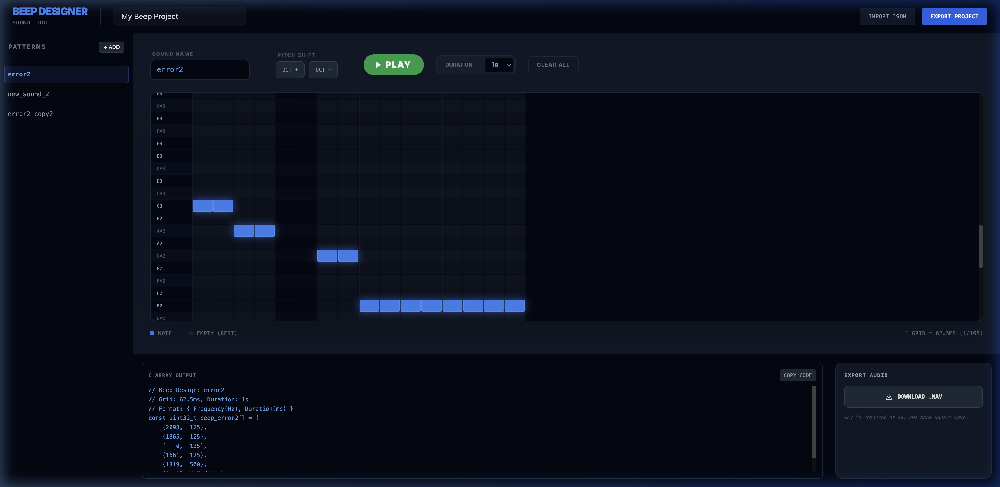

# Beep Designer

A high-performance web-based sound design tool for microcontrollers (e.g., ESP32) using piezo buzzers.

---

[日本語のREADMEはこちら (readme_jp.md)](readme_jp.md)

---

**Beep Designer** is a professional-grade web application for embedded engineers. It enables creating "musical" or "informative" beep patterns for piezo sounders via a familiar Piano Roll interface.

### Key Features

- **Piano Roll Editor**
    - Edit patterns on a high-precision grid (62.5ms / 16th note resolution).
    - Support adding, deleting, and batch octave-shifting for notes.
- **Hum-to-Beep (Vocal Input)**
    - Analyze microphone input in real-time and convert it into musical notes.
    - Support slow-motion recording (1x, 2x, 3x) for easier input of complex phrases.
    - Trim initial silence automatically via "Head-Perfecting" to align with the first beat.
- **Web Audio Preview**
    - Simulate piezo buzzer timbre using square wave synthesis.
    - Merge consecutive identical notes (Legato) for gap-free sound.
- **C-Code & WAV Export**
    - Generate `uint32_t` arrays in `{ frequency, duration }` format for firmwares.
    - Render and download high-quality (44.1kHz mono) WAV files.
- **Project Management**
    - Persist editing progress automatically using local browser storage.
    - Support full project import and export in JSON format.

### Getting Started

1.  **Clone**: `git clone https://github.com/sac-inoue/BeepDesigner.git`
2.  **Install**: `npm install`
3.  **Run**: `npm run dev`
4.  **Edit**: Open `http://localhost:5173/` and start your melody!

### Tech Stack

- **Frontend**: React 18, TypeScript, Vite
- **Styling**: Tailwind CSS
- **Audio Engine**: Web Audio API

## License

MIT License
